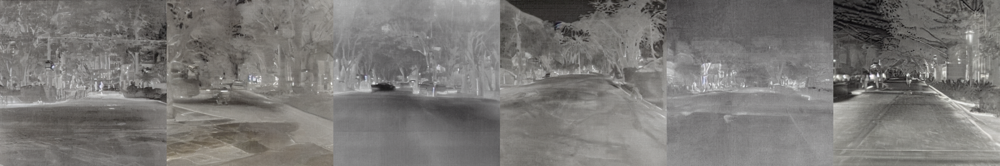
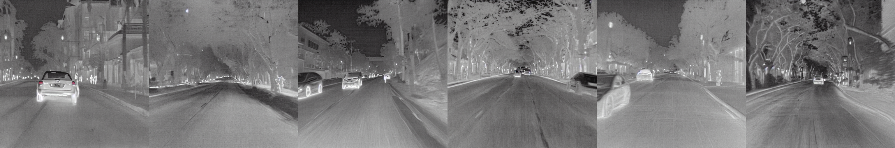

## LoRA Finetuning Stable Diffusion with FLIR Dataset
This repository contains codes for generating IR images by LoRA finetuning Stable Diffusion v1.5 with empty prompts using FLIR dataset.

Codes are based on [example code](https://github.com/huggingface/diffusers/blob/main/examples/text_to_image/train_text_to_image_lora.py) of diffusers. [PAG](https://github.com/KU-CVLAB/Perturbed-Attention-Guidance) is used for inference. 


*inference w/o pag*

*inference w/ pag*

## Dataset Download
Download FLIR Dataset from [here](https://www.kaggle.com/datasets/deepnewbie/flir-thermal-images-dataset)

## Environment Setting
Diffusers

```
conda create -n flir python=3.8
conda activate flir
conda install -c conda-forge 
conda install -c pytorch cudatoolkit=11.3 pytorch=1.11.0 torchvision=0.12.0 # depend on your GPU
```
LoRA Finetuing (from [diffusers](https://github.com/huggingface/diffusers/tree/main/examples))
```
pip install -r requirements.txt
```


## Training
Checkpoints and weights are saved in ```finetune/<EXP>```
```
sh train.sh
```

## Inference
Make directory ```/result``` 
and place your lora weights ```pytorch_lora_weights.safetensors``` on ```/lora_weight```. 

You can just fix above paths in the inference code.
```
python inference.py
```
Also, you can use  ```make_grid.py``` for generating the grid of images.